# PlumePrint — System Architecture & Technical Specification

## 1. Executive Summary & Core Concept

**PlumePrint** is an automated environmental auditing system that reconciles industrial self-reported emission event filings against empirical ambient air quality measurements and atmospheric wind trajectories.

In industrial regions such as the Texas Gulf Coast and Permian Basin, industrial facilities are legally required to file notices and reports of unauthorized emission events with state regulators (e.g. TCEQ Title 30 TAC § 101.201). Concurrently, regulatory air monitoring networks (EPA AQS / State networks) record hourly ambient pollutant concentrations. Historically, these two public record sets have existed in separate administrative silos without automated bidirectional cross-referencing.

PlumePrint establishes a bidirectional audit across both systems:
1. **Did the monitor see what the facilities reported?** Evaluates whether self-reported releases left a detectable physical signature at nearby monitors when wind blew toward the station.
2. **Was what the monitor saw ever reported?** Identifies multi-hour elevated ambient pollution episodes at regulatory monitors and determines whether any facility upwind filed an emission event report covering that window.

---

## 2. System Context

The system interfaces with public environmental data sources, processes records through a deterministic pipeline, and surfaces evidence through an interactive workspace and structured public records requests.

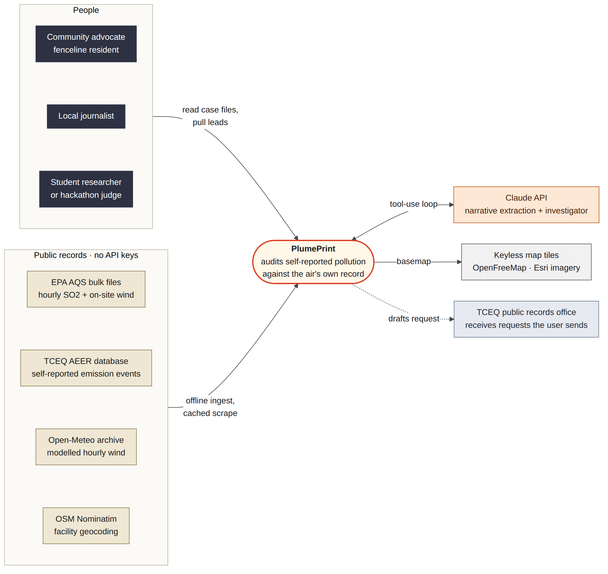

### External Interfaces
- **EPA Air Quality System (AQS)**: Hourly ambient concentrations (SO2, parameter 42401) and on-site meteorological measurements (wind speed and direction).
- **TCEQ Air Emission Event Reports (AEER / STEERS)**: Self-reported unauthorized emissions notices, including event start/end timestamps, pollutant mass (pounds), facility identifiers, and root cause narratives.
- **Open-Meteo Historical Weather API**: High-resolution 10m wind velocity and direction archives for sites lacking collocated meteorological sensors.
- **EPA Facility Registry Service (FRS) & ECHO**: Facility geospatial coordinates, regulatory identifiers (RN/CN), and site boundary approximations.

---

## 3. Five-Tier System Architecture

PlumePrint is architected in five decoupled tiers with strict boundary interfaces.

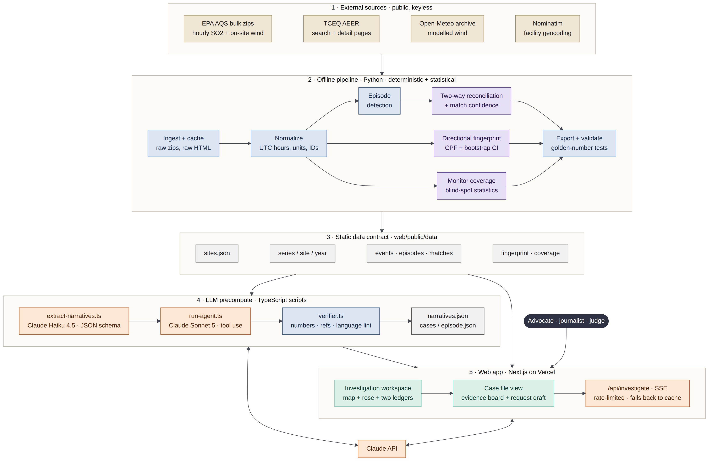

```
┌────────────────────────────────────────────────────────┐
│ 1. External Sources (EPA AQS, TCEQ AEER, Open-Meteo)   │
└───────────────────────────┬────────────────────────────┘
                            │ Raw Records / Scraped HTML / CSV
┌───────────────────────────▼────────────────────────────┐
│ 2. Deterministic Pipeline (Python 3.11 / Pandas / Sci) │
│    Ingest → UTC Alignment → Spatial → Match → Verdict  │
└───────────────────────────┬────────────────────────────┘
                            │ Static JSON Contract
┌───────────────────────────▼────────────────────────────┐
│ 3. Data Contract (`web/public/data/*.json`)            │
│    Zero runtime database; committed static schemas     │
└───────────────────────────┬────────────────────────────┘
                            │ Deterministic Evidence Feeds
┌───────────────────────────▼────────────────────────────┐
│ 4. Investigation Engine (Agentic Verification Loop)    │
│    Deterministic Tool Execution + Fact-Checking Linter │
└───────────────────────────┬────────────────────────────┘
                            │ Verified Case Files & UI View Models
┌───────────────────────────▼────────────────────────────┐
│ 5. Client Application (Next.js 15 / MapLibre / SVG)    │
│    Two Ledgers Timeline, Dynamic Upwind Cones, TPIA    │
└────────────────────────────────────────────────────────┘
```

---

## 4. Pipeline DAG & Processing Stages

The offline pipeline (`pipeline/`) executes as an acyclic directed graph (DAG) across 13 stages:

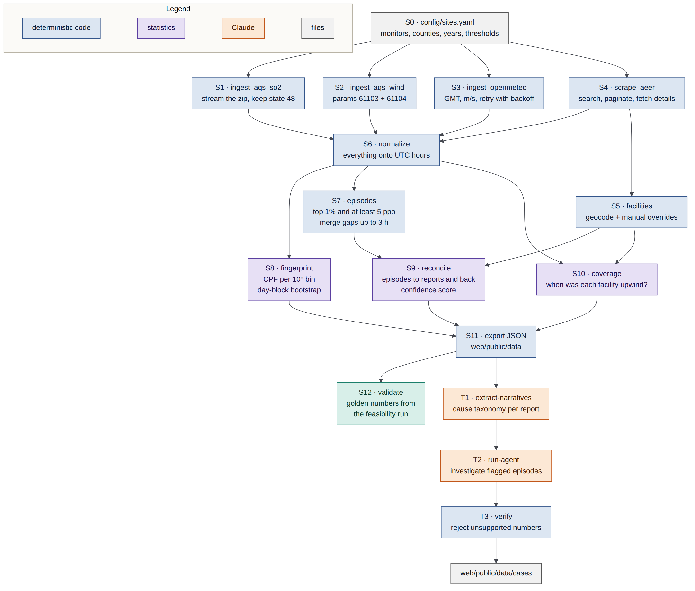

| Stage | Module | Description |
|---|---|---|
| **S0** | `pipeline.config` | Loads site definitions, coordinates, bounding boxes, and county FIPS mappings |
| **S1** | `pipeline.ingest_aqs` | Downloads and parses EPA AQS hourly ambient concentration and meteorological files |
| **S2** | `pipeline.ingest_wind` | Queries Open-Meteo 10m wind vector components (u, v) for sites without on-site anemometers |
| **S3** | `pipeline.ingest_tceq` | Scrapes TCEQ AEER search forms and individual incident detail pages |
| **S4** | `pipeline.ingest_facilities`| Queries EPA FRS to resolve facility geographic coordinates and footprints |
| **S5** | `pipeline.clean_align` | Normalizes heterogeneous local timestamps into a unified continuous UTC index |
| **S6** | `pipeline.detect_episodes` | Extracts multi-hour pollution episodes above site-specific baseline thresholds |
| **S7** | `pipeline.fingerprint` | Computes bivariate directional probability distributions (wind rose lobes) |
| **S8** | `pipeline.spatial` | Evaluates hourly candidate upwind status using dispersion cone geometry |
| **S9** | `pipeline.match` | Reconciles monitor episodes against event reports using temporal and bearing fit |
| **S10**| `pipeline.verdict` | Assigns deterministic rule-based verdicts to episodes and visibility flags to reports |
| **S11**| `pipeline.export_json` | Validates data contracts and exports client-ready JSON files |
| **S12**| `pipeline.validate` | Asserts output consistency against golden reference test cases |

---

## 5. Time Synchronization & Clock Alignment

Air monitoring datasets and emission event databases use differing time conventions. Harmonization to an exact UTC hour index is critical; a 1-hour time offset would invalidate directional matches.

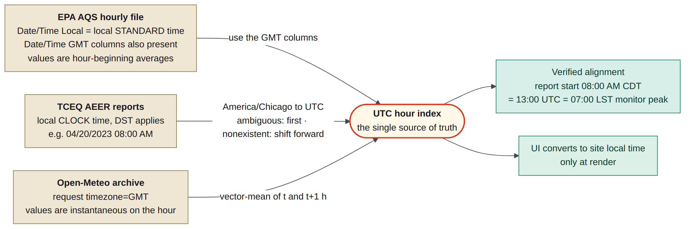

- **EPA AQS**: Reported in Local Standard Time (LST) year-round without daylight saving adjustments. Converted using pre-computed GMT timestamp offsets.
- **TCEQ AEER**: Filed in local civil clock time (Central Time, observing Central Standard Time CST / Central Daylight Time CDT). Converted to UTC via timezone-aware calendar offsets.
- **Open-Meteo**: Requested directly in UTC (GMT) and aligned to continuous hourly intervals.

---

## 6. Spatial & Atmospheric Dispersion Geometry

Reconciling whether an industrial facility sat upwind of a monitor during an emission event requires accounting for facility footprint size and wind direction variance.

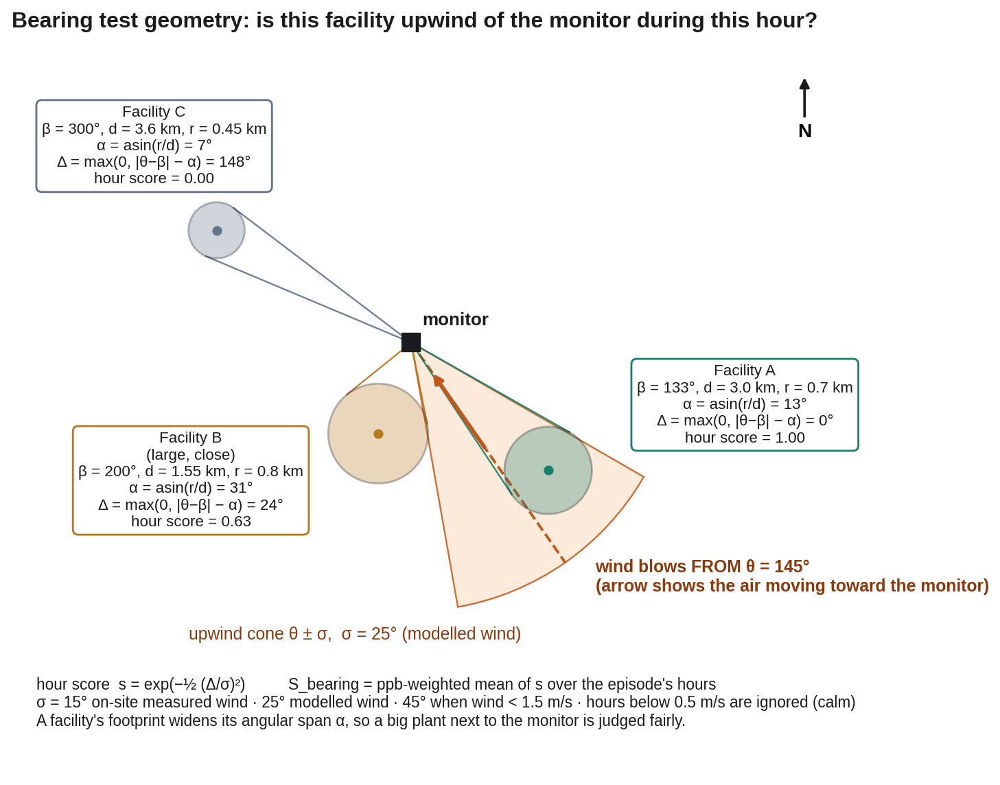

### Formulation
For a monitor at $(lat_m, lon_m)$ and a facility centroid at $(lat_f, lon_f)$ with radius $R_f$:
1. **Nominal Bearing $\theta_0$**: Initial geodesic bearing from monitor to facility:
   $$\theta_0 = \operatorname{atan2}(\sin \Delta \lambda \cos \phi_f, \; \cos \phi_m \sin \phi_f - \sin \phi_m \cos \phi_f \cos \Delta \lambda)$$
2. **Subtended Angular Span $\alpha$**:
   $$\alpha = \arcsin\left(\min\left(1.0, \; \frac{R_f}{D}\right)\right)$$
   Where $D$ is the great-circle distance between monitor and facility.
3. **Wind Direction Uncertainty Arc $\sigma$**:
   $$\sigma = \begin{cases} 
   15^\circ & \text{on-site measured wind, } u > 2\text{ m/s} \\
   25^\circ & \text{on-site measured wind, } u \le 2\text{ m/s (light winds)} \\
   30^\circ & \text{numerical weather model reanalysis} 
   \end{cases}$$
4. **Upwind Criterion**: A facility is upwind during hour $t$ if the wind direction arriving at the monitor $\theta_w(t)$ falls within:
   $$\theta_w(t) \in [\theta_0 - \alpha - \sigma, \; \theta_0 + \alpha + \sigma]$$

---

## 7. Deterministic Verdict Rules

Verdicts are strictly deterministic and rule-based. Confidence scores are used only to rank candidate explanations, never to assign verdicts.

### Episode Verdict Workflow
Evaluates each ambient pollution episode at the monitor:

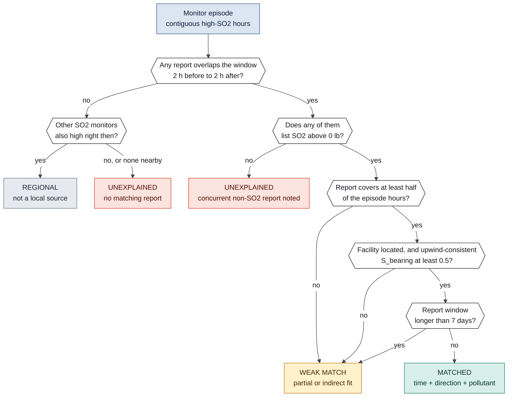

- **`MATCHED`**: A self-reported emission event of the same pollutant overlaps the episode window within $\pm 2$ hours and originated from an upwind bearing.
- **`WEAK_MATCH`**: An emission event overlaps temporally but occurred during startup/shutdown or crosswind conditions with moderate confidence.
- **`UNEXPLAINED`**: The monitor recorded elevated pollution, but no industrial facility within the county filed a matching report covering that window.
- **`REGIONAL`**: Elevated concentrations were simultaneously observed across multiple monitors in the region, indicating background or regional transport rather than an isolated point source.

### Report Visibility Workflow
Evaluates each filed emission event report:

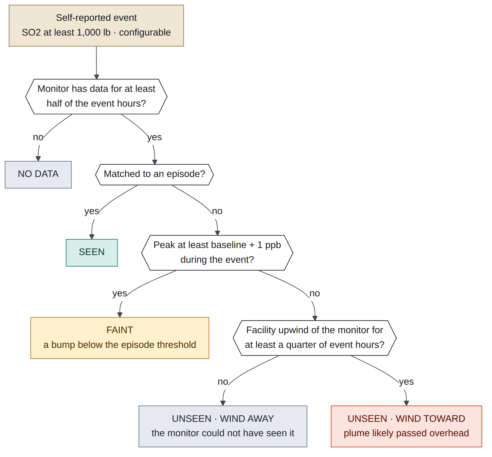

- **`SEEN`**: A distinct ambient concentration spike ($> 5$ ppb or $2\times$ baseline) was recorded while the facility was upwind.
- **`FAINT`**: Minor elevation was observed, but did not meet the episode threshold.
- **`UNSEEN (WIND AWAY)`**: The monitor was crosswind or downwind of other sources during the event; the plume traveled elsewhere.
- **`UNSEEN (WIND TOWARD)`**: The monitor was directly downwind of the facility during the reported release, yet recorded no anomalous spike (indicative of plume lofting or dispersion discrepancies).

---

## 8. Candidate Scoring Model

When an episode has multiple potential candidate reports, they are ranked using a multi-factor confidence model:

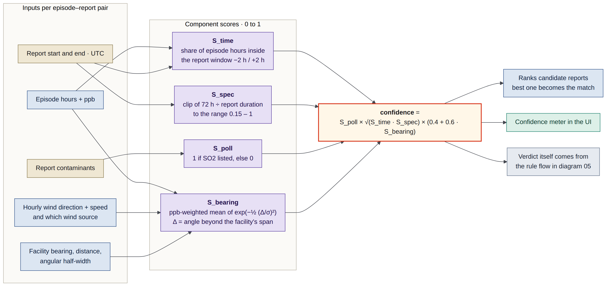

$$S_{\text{total}} = w_t S_{\text{time}} + w_b S_{\text{bearing}} + w_m S_{\text{mass}}$$

- **Temporal Alignment $S_{\text{time}}$**: Overlap Jaccard coefficient between reported release window $[t_{r,\text{start}}, t_{r,\text{end}}]$ and monitor episode window $[t_{e,\text{start}}, t_{e,\text{end}}]$.
- **Bearing Alignment $S_{\text{bearing}}$**: Fraction of episode hours where wind direction intersected the facility's angular footprint cone.
- **Mass Plausibility $S_{\text{mass}}$**: Log-scaled mass released relative to peak ambient concentration.

---

## 9. Data Model & Contract Schema

All pipeline outputs are validated against formal JSON schemas located in `web/public/data/`:

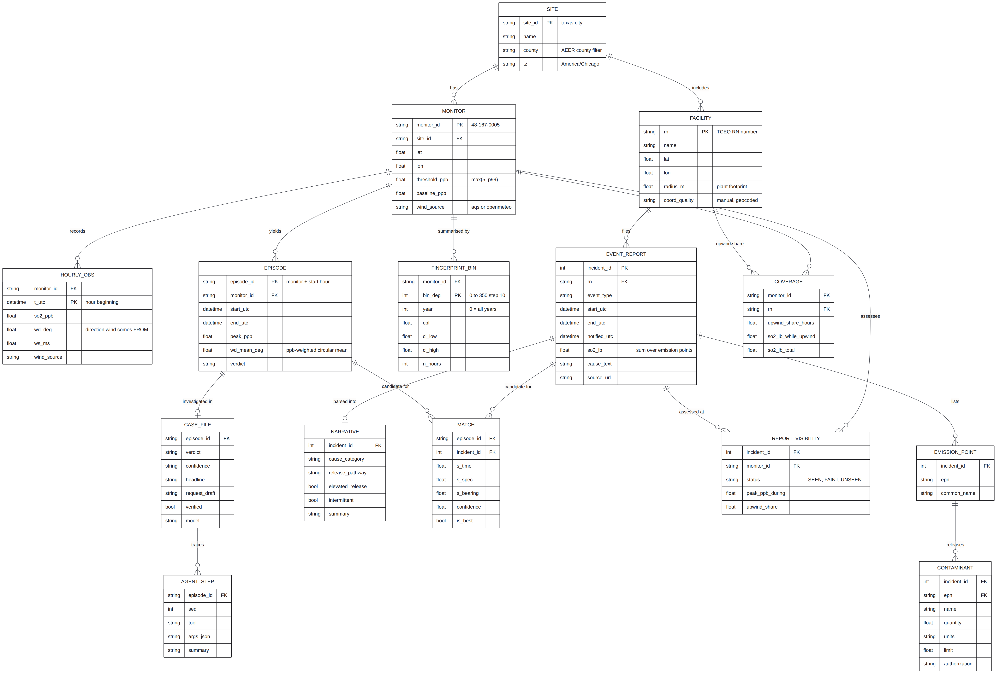

### Key Entities
- **`Site`**: Top-level study area encompassing one or more regulatory monitors and industrial facilities across target counties.
- **`Monitor`**: Physical EPA AQS monitoring station, geographic coordinates, and sensor metadata.
- **`Facility`**: Industrial complex, EPA FRS ID, TCEQ RN/CN, approximate centroid, and spatial boundary radius.
- **`Episode`**: Continuous elevated pollution event extracted from hourly monitor series.
- **`EventReport`**: Scraped and structured TCEQ emission event report listing pollutant quantities.
- **`Fingerprint`**: Bivariate polar distribution of high-concentration hours binned across 36 ten-degree directional sectors.
- **`StoredCase`**: Evidence synthesis, audit trace, innocent explanations, and public records request draft.

---

## 10. Agentic Investigation & Evidence Verification

For each unexplained or matched episode, an automated investigative agent constructs a structured case file.

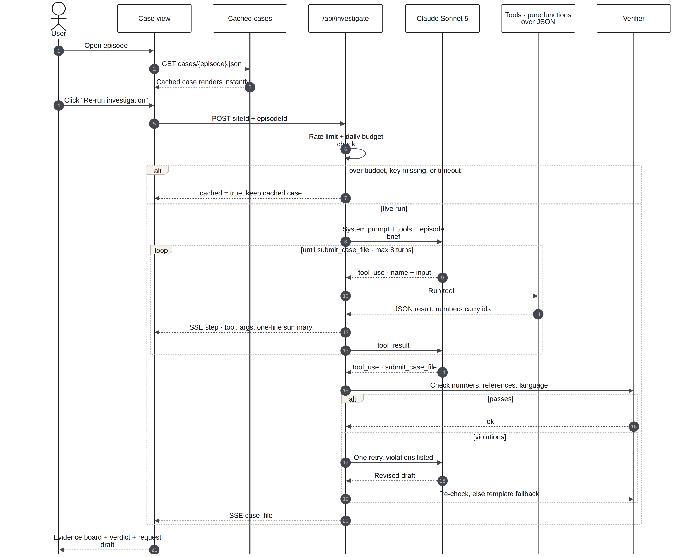

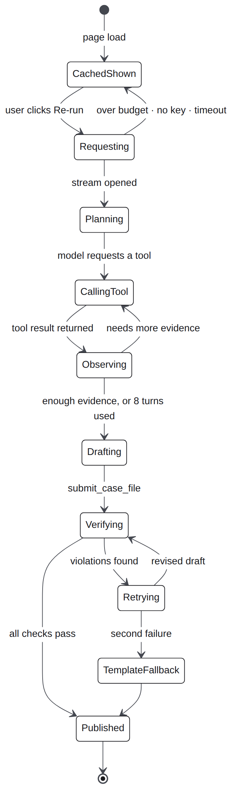

### Anti-Hallucination Integrity Verifier
To prevent fabricated claims or inaccurate citations, all generated case files pass through an automated factual linter before storage:
1. **Number Provenance**: Every quantitative figure cited in the text (concentrations, dates, pounds, bearings) must exist in the raw deterministic pipeline output.
2. **Citation Resolvability**: All evidence tags (`ep:...`, `mon:...`, `fac:...`) must resolve to active entities in the database.
3. **Language Policy Enforcement**: Accusatory language ("illegal", "violator", "guilty", "cover-up") is strictly forbidden; objective phrasing ("unexplained episode", "no matching report filed") is mandated.
4. **Innocent Alternative Hypotheses**: The analysis must explicitly detail plausible non-culpable mechanisms (routine permitted batch cycles, mobile barge traffic, releases below statutory reporting thresholds).

---

## 11. Frontend Application Architecture

The web interface is built as a static, client-first Next.js 15 application designed for zero-latency review.

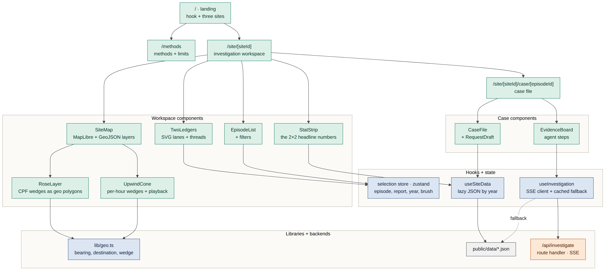

### Interactive Modules
- **`SiteWorkspace`**: Central coordination hub managing active episode/report selections across components.
- **`TwoLedgers`**: Interactive SVG visualization featuring two synchronized lanes:
  - *Top Lane*: Facility self-reports plotted as log-scaled mass bars, color-coded by visibility.
  - *Bottom Lane*: Continuous hourly ambient SO2 trace with highlighted episode peaks.
  - *Connecting Arcs*: Dynamic Bézier curves linking confirmed matched pairs.
  - *Inspector Dock*: Contextual inspection card providing instant details and one-click case navigation.
- **`MapPanel` & `SiteMap`**: GPU-accelerated MapLibre satellite map rendering facility polygons and sweeping upwind dispersion arcs ($\theta \pm \sigma$) dynamically as episodes are selected.
- **`WindRose`**: Canvas-based polar directional fingerprint.
- **`RequestDraft`**: Civic action module providing one-click copy with toast feedback, formatted `.txt` download, and direct mailto link to TCEQ Open Records citing Texas Public Information Act (Gov't Code § 552).

---

## 12. Technical Diagrams Index

The accompanying technical diagrams in [`docs/diagrams/`](diagrams/) provide detailed architectural references:

| ID | Name | Architecture Focus |
|---|---|---|
| **01** | [`system-context`](diagrams/01-system-context.png) | System boundary, regulatory data sources, and user personas |
| **02** | [`system-architecture`](diagrams/02-system-architecture.png) | 5-tier architecture from raw ingestion to static edge serving |
| **03** | [`data-pipeline`](diagrams/03-data-pipeline.png) | Stage execution DAG (S0 through S12) |
| **04** | [`time-alignment`](diagrams/04-time-alignment.png) | Harmonization of AQS LST, TCEQ local clock, and Open-Meteo GMT |
| **05** | [`episode-verdict-flow`](diagrams/05-episode-verdict-flow.png) | Deterministic decision tree for monitor episode classifications |
| **06** | [`report-visibility-flow`](diagrams/06-report-visibility-flow.png) | Deterministic decision tree for report visibility classifications |
| **07** | [`scoring-model`](diagrams/07-scoring-model.png) | Mathematical formulation of candidate match confidence |
| **08** | [`data-model`](diagrams/08-data-model.png) | Relational entity schema for static JSON contract |
| **09** | [`agent-sequence`](diagrams/09-agent-sequence.png) | Interactive investigation loop and verification checks |
| **10** | [`agent-states`](diagrams/10-agent-states.png) | Investigation state machine and fallback handling |
| **11** | [`frontend-architecture`](diagrams/11-frontend-architecture.png) | Next.js component hierarchy and state flow |
| **12** | [`deployment`](diagrams/12-deployment.png) | Static export and production deployment topology |
| **15** | [`user-flow`](diagrams/15-user-flow.png) | End-to-end user navigation from macro punchline to civic action |
| **16** | [`upwind-geometry`](diagrams/16-upwind-geometry.png) | Mathematical dispersion geometry and facility angular span |
| **17** | [`two-ledgers-texas-city-2023`](diagrams/17-two-ledgers-texas-city-2023.png) | Empirical two ledgers reconciliation chart for Texas City (2023) |
| **18** | [`roses-three-sites-2023`](diagrams/18-roses-three-sites-2023.png) | Directional polar fingerprints across three industrial monitors |
